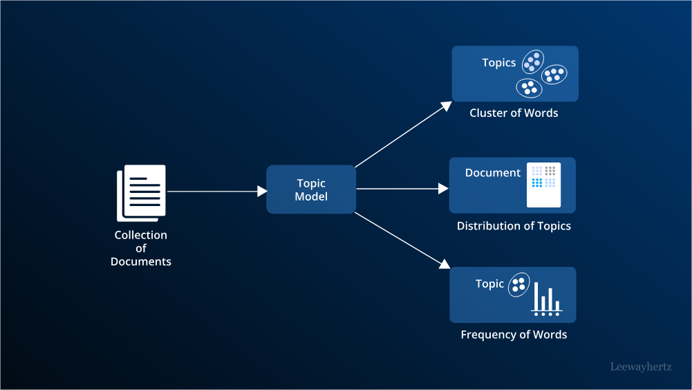
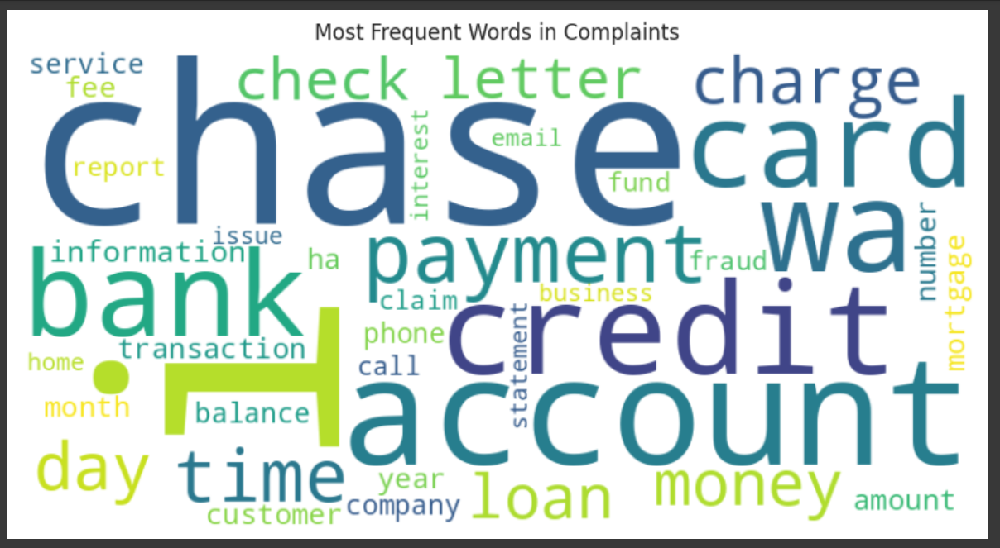
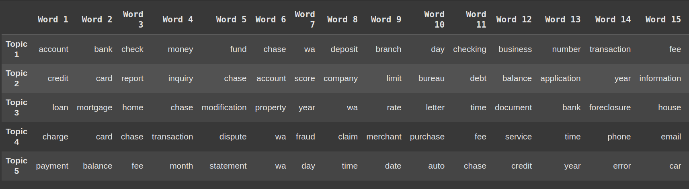
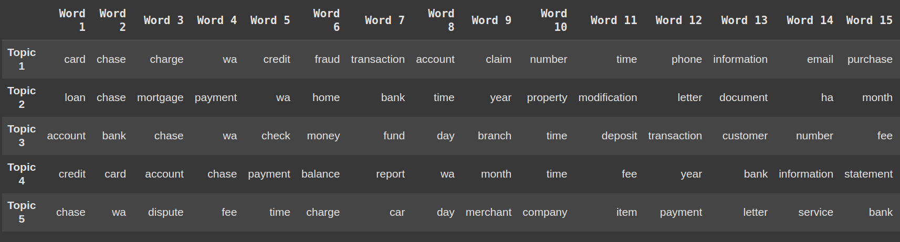
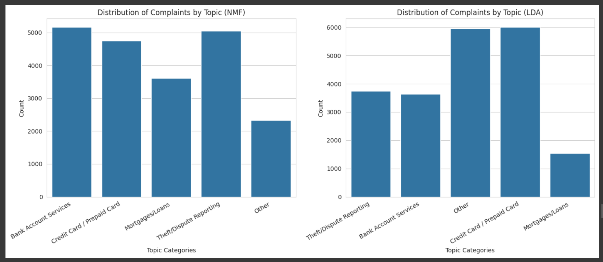
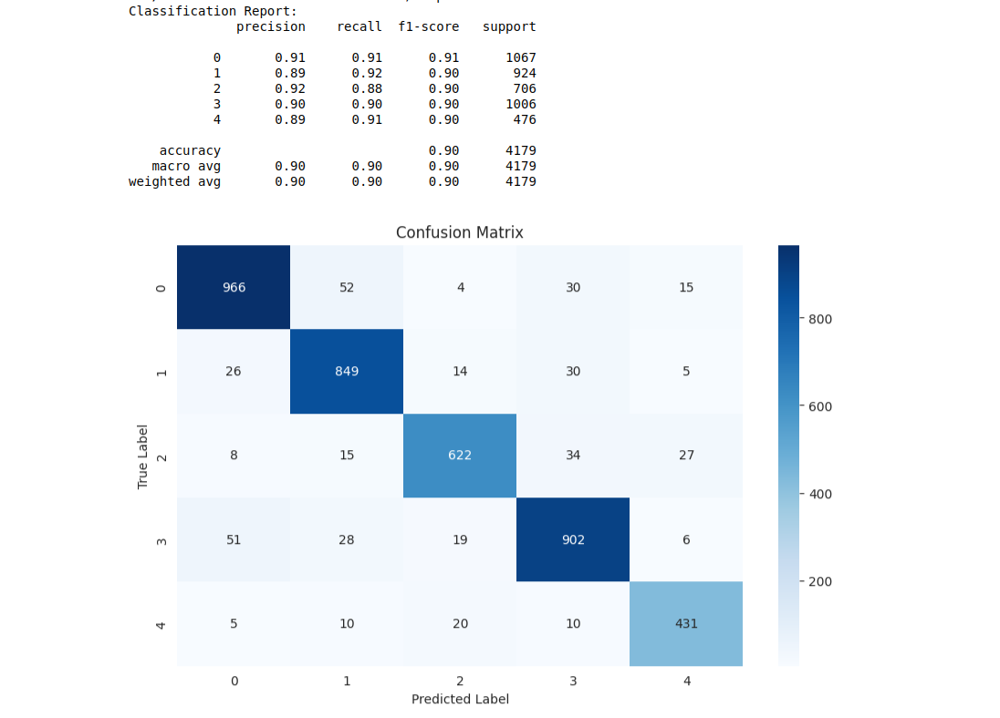
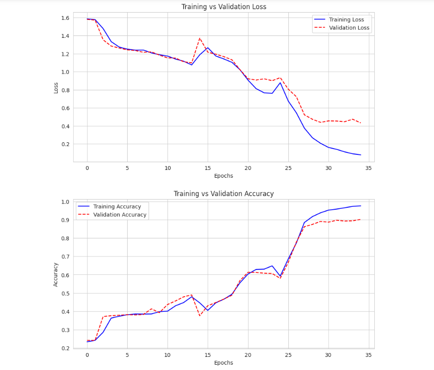
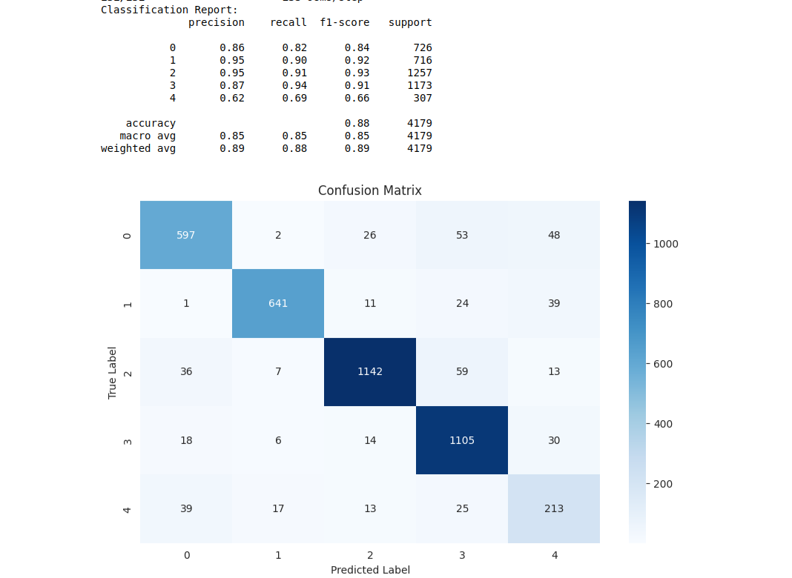
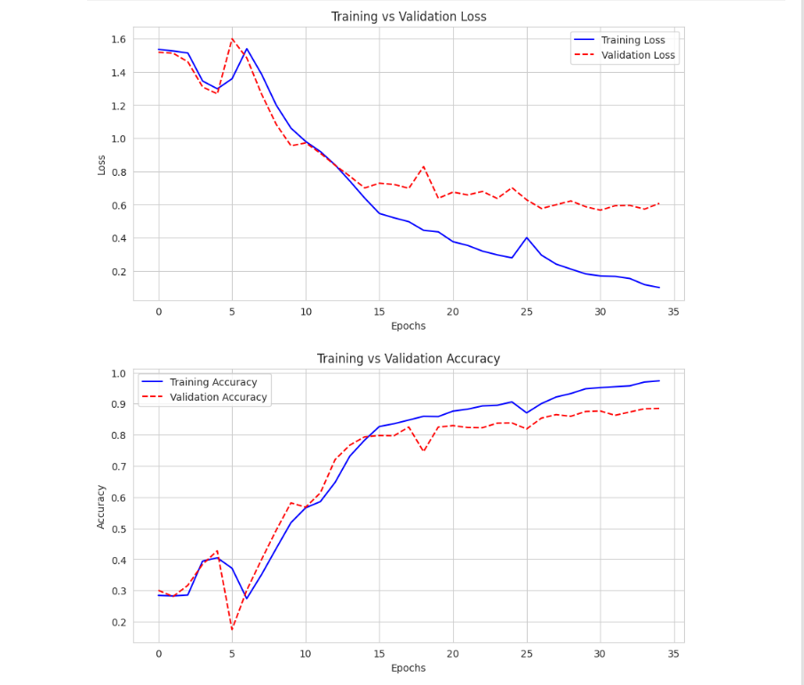

# Business Understanding
Business Understanding In the financial sector, customer complaints serve as a crucial source of insight into potential issues with products and services. Addressing these complaints efficiently not only minimizes customer dissatisfaction but also fosters loyalty and enhances the company’s reputation. However, financial institutions offering multiple services—such as credit cards, banking, and mortgage/loan services—receive a vast number of complaints daily.

Manually categorizing and routing these complaints to the appropriate departments is inefficient, costly, and prone to errors. Automating this process will streamline customer support, reduce response times, and improve overall customer satisfaction.

To achieve this, the company seeks to leverage Natural Language Processing (NLP) to analyze and categorize customer complaints effectively. Using topic modeling, the aim is to identify recurring themes in complaints, enabling better understanding of customer pain points and optimizing complaint resolution workflows. Ultimately, this will facilitate the development of a model, which will be trained to classify new customer complaints into predefined categories automatically.

# Business Objective
- To automate the classification of customer complaints based on financial products and services.
- To enhance complaint resolution efficiency by routing support tickets to the appropriate departments automatically.
- To improve customer satisfaction by reducing complaint response times and ensuring accurate resolution.
- To identify recurring themes and pain points in customer complaints using topic modeling.

# Data Source

- Dataset Link: [(dataset link here)](https://www.kaggle.com/datasets/nirmalgaud/customer-complaints-ticket-classification)
- The dataset, contains unstructured text data related to customer complaints. It comprises of 78313 rows and 18 columns. 

##  Data Processing

- The dataset consists of unstructured customer complaints.
- Handling missing values and duplicates.
- Text preprocessing steps include **tokenization, stopwords removal, lemmatization, and vectorization**.
- Word cloud generation to identify common terms.

## Topic Modeling

We explored two topic modeling techniques:

- **Non-Negative Matrix Factorization (NMF):** A linear algebra-based technique that decomposes the document-term matrix into topic distributions.
- **Latent Dirichlet Allocation (LDA):** A probabilistic model that assigns words to topics based on a distributional approach.

### Topic allocation using NMF 

### Topic allocation using LDA

# Topic Distribution between LDA and NMF 

### 3. Supervised Classification

After extracting topics, we trained a **Bidirectional Long Short-Term Memory (Bi-LSTM)** model to classify customer complaints based on the identified topics.

*(Insert model architecture image)*

## Results

### Topic Modeling Performance

- **NMF:** Provided clear, distinct topics with strong interpretability.
- **LDA:** Performed reasonably well but had overlapping topics, making interpretation slightly more challenging.

### Bi-LSTM Model Performance
| Model         | Precision | Recall | F1-Score | Accuracy |
|--------------|-----------|--------|----------|----------|
| NMF + Bi-LSTM | 90.2%     | 90.4%  | 90.2%    | 90.3%    |
| LDA + Bi-LSTM | 85.0%     | 85.2%  | 85.2%    | 88.7%    |

## NMF Results 

## LDA Results 

The **Bi-LSTM model trained on NMF topic distributions performed better** than the LDA-based approach, achieving higher accuracy and F1-score, indicating better classification capabilities.

## Conclusion

- **Topic modeling** helped in structuring unstructured customer complaints into meaningful topics.
- The **NMF-based approach** was more effective in generating well-separated topics compared to LDA.
- The **Bi-LSTM model performed well**, with the NMF features yielding the best classification results.
- Automating customer complaint classification using NLP can significantly reduce manual effort and improve response efficiency in financial institutions.

## Recommendations

- **Deploy the NMF + Bi-LSTM model** for real-time classification of customer complaints.
- Further fine-tune hyperparameters of the Bi-LSTM model to improve accuracy.
- Explore alternative topic modeling techniques such as **BERTopic** for better topic separation.
- Implement a **feedback loop** to retrain the model with new data for continuous improvement.

## Future Work

- **Integrate a chatbot** for automated responses based on classified complaints.
- **Implement real-time complaint classification** using an API.
- **Expand the model to handle multilingual complaints**.

